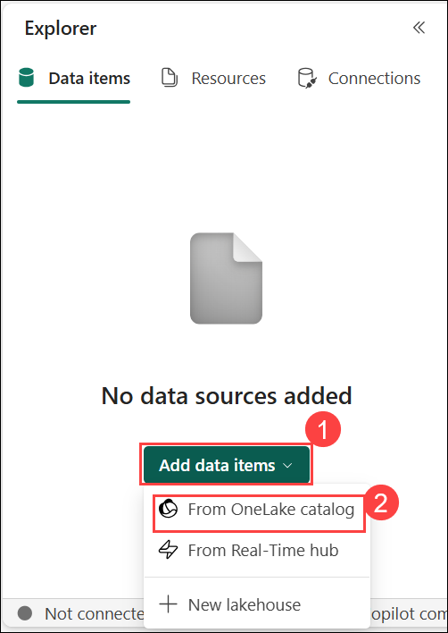

#  Exercise 1: Analyze data with Apache Spark

### Estimated Duration: 100 Minutes

## Overview

In this exercise, you will use Apache Spark within Microsoft Fabric to ingest, process, and analyze data using PySpark. You'll begin by creating a lakehouse to store raw data files and then use notebooks to write and run Spark code for data exploration, transformation, and analysis. You'll learn how to work with DataFrames, apply filtering and grouping operations, use Spark SQL for querying data, and visualize results using built-in tools and Python libraries like matplotlib and seaborn. This end-to-end lab provides a practical introduction to scalable data analytics in Microsoft Fabric.

## Lab objectives

You will be able to complete the following tasks:

- Task 1: Create a lakehouse and upload files
- Task 2: Create a notebook
- Task 3: Load data into a dataframe
- Task 4: Explore data in a dataframe
- Task 5: Aggregate and group data in a dataframe
- Task 6: Use Spark to transform data files
- Task 7: Work with tables and SQL
- Task 8: Visualize data with Spark
- Task 9: Save the notebook and end the Spark session

## Task 1: Create a lakehouse and upload files

In this task, you will create a lakehouse to organize and analyze your data files. After setting up your workspace, you'll switch to the *Data Engineering* experience in the portal to initiate the creation of the data lakehouse.

1. From the left pane, select the **fabric-<inject key="DeploymentID" enableCopy="false"/> (1)** workspace, then click **+ New item (2)**.

    

1. In the **New item** window, search for **Lakehouse (1)** in the search bar, then select the **Lakehouse (2)** from the results to proceed.

    

1. Enter the **Name** as **fabric_lakehouse<inject key="DeploymentID" enableCopy="false"/> (1)** and click on **Create (2)**.

     

1. From the Explorer pane, click the **ellipsis (...) (1)** next to the **Files** folder, choose **Upload (2)**, and then click **Upload folder (3)** to import a folder from your local machine.

    

1. In the Upload folder dialog, click the **folder** icon to browse and select the folder you want to upload.

    

1. Browse to `C:\LabFiles\Files`, select the **orders (1)** folder, and click **Upload (2)** to initiate the upload process.

    

1. Click **Upload** in the confirmation pop-up to proceed with uploading all files from the orders folder.

    

1. Click **Upload** again to confirm.

    

1. After uploading, expand **Files (1)** in the Explorer pane, select the **orders (2)** folder, and verify that the CSV files are listed.

    

## Task 2: Create a notebook

In this task, you will create a notebook to work with data in Apache Spark. Notebooks provide an interactive environment where you can write and run code in multiple languages, while also allowing you to add notes for documentation.

1. From the left pane, click on **My workspace (1)**, then select the **fabric-<inject key="DeploymentID" enableCopy="false"/> (2)** workspace.  
   
    

1. In the **fabric-<inject key="DeploymentID" enableCopy="false"/>** workspace, click on **+ New item (1)**, search for **Notebook (2)** in the search bar, and then select **Notebook (3)** from the results.

    

1. On the **New Notebook** window, leave the default name **Notebook_1 (1)** as it is, and then click on **Create (2)**.
 
    

    > **Note:** After a few seconds, a new notebook containing a single *cell* will open. Notebooks are made up of one or more cells that can contain *code* or *markdown* (formatted text).

1. From the **Explorer** panel on the left, under the **Data items** tab, open the **Add data items (1)** dropdown and select **From OneLake catalog (2)**.

    

1. Select the checkbox next to **fabric_lakehouse<inject key="DeploymentID" enableCopy="false"/>** **(1)**, then click **Connect (2)** in the bottom-right corner.

    

1. Select the first cell (which is currently a code cell), then click the **M↓** button in the top-right dynamic toolbar to convert it to a **markdown** cell.

    

1. Click the **Edit** icon in the top-right corner of the cell, then replace the existing content with the code below.

    

    ```
    # Sales order data exploration
    Use the code in this notebook to explore sales order data.
    ```

1. Click anywhere outside the cell in the notebook to exit editing mode and view the rendered markdown.

    

## Task 3: Load data into a dataframe

In this task, you will load data into a dataframe to prepare it for analysis. Dataframes in Spark, similar to Pandas dataframes in Python, offer a structured way to manage and manipulate data organized in rows and columns.

> **Note:** Spark supports multiple coding languages, including Scala, Java, and others. In this exercise, we'll use *PySpark*, which is a Spark-optimized variant of Python. PySpark is one of the most commonly used languages on Spark and is the default language in Fabric notebooks.

1. With the notebook open, expand the **fabric_lakehouse<inject key="DeploymentID" enableCopy="false"/> (1)** under **Explorer**, then expand **Files (2)**, select the **orders (3)** folder, click the **ellipsis (...) (4)** menu next to 2019.csv, and choose **Load data (5)** -> **Spark (6)**.

    

1. A **new code** cell with the following code will be added to the notebook:

    ```python
   df = spark.read.format("csv").option("header","true").load("Files/orders/2019.csv")
   # df now is a Spark DataFrame containing CSV data from "Files/orders/2019.csv".
   display(df)
    ```

    

    > **Note:** You can hide the Lakehouse Explorer panes on the left by using their **<<** icons. Doing so will help you focus on the notebook.

1. Use the **Run** cell button on the left side of the cell to execute it.

    

    > **Note:** Since this is your first time running Spark code, a Spark session will be started, which may take about a minute to complete; subsequent runs will execute faster.

1. Once the cell command has completed, review the output below the cell, which should resemble the following:

    

1. The output displays the rows and columns from the 2019.csv file; however, note that the column headers are incorrect because the default code assumes the CSV includes headers, whereas this file contains data only, without header information.

1. Modify the code to set the **header** option to **false**, as shown below:

    ```python
   df = spark.read.format("csv").option("header","false").load("Files/orders/2019.csv")
   # df now is a Spark DataFrame containing CSV data from "Files/orders/2019.csv".
   display(df)
    ```

1. **Re-run (1)** the cell, then review the **output (2)**, which should resemble the following:

    

1. The dataframe now correctly treats the first row as data, but the column names are auto-generated and unclear. To properly interpret the data, explicitly define the correct schema and data types for the file.

1. Modify the code as follows to define a schema and apply it when loading the data:

    ```python
   from pyspark.sql.types import *

   orderSchema = StructType([
       StructField("SalesOrderNumber", StringType()),
       StructField("SalesOrderLineNumber", IntegerType()),
       StructField("OrderDate", DateType()),
       StructField("CustomerName", StringType()),
       StructField("Email", StringType()),
       StructField("Item", StringType()),
       StructField("Quantity", IntegerType()),
       StructField("UnitPrice", FloatType()),
       StructField("Tax", FloatType())
       ])

   df = spark.read.format("csv").schema(orderSchema).load("Files/orders/2019.csv")
   display(df)
    ```

1. **Run (1)** the modified cell, then review the **output (2)**, which should resemble the following:

    

1. Now the dataframe includes the correct column names (along with the built-in **Index** column representing the row order). The data types for each column are specified using the standard types imported from the Spark SQL library at the top of the cell.

1. Confirm that your changes have been applied to the data by viewing the dataframe. Run the following cell:

    ```python
    display(df)
    ```

1. The dataframe currently includes only the data from the **2019.csv** file. Modify the code to use a * wildcard in the file path so it reads sales order data from all CSV files in the **orders** folder:

    ```python
    from pyspark.sql.types import *

    orderSchema = StructType([
        StructField("SalesOrderNumber", StringType()),
        StructField("SalesOrderLineNumber", IntegerType()),
        StructField("OrderDate", DateType()),
        StructField("CustomerName", StringType()),
        StructField("Email", StringType()),
        StructField("Item", StringType()),
        StructField("Quantity", IntegerType()),
        StructField("UnitPrice", FloatType()),
        StructField("Tax", FloatType())
    ])

    df = spark.read.format("csv").schema(orderSchema).load("Files/orders/*.csv")
    display(df)
    ```

1. **Run (1)** the modified code cell, then review the **output (2)**, which should now include sales data from **2019**, **2020**, and **2021**.

    

    >**Note:** Only a subset of the rows is displayed, so you may not immediately see data from all years (2019, 2020, and 2021) in the output.

## Task 4: Explore data in a dataframe

In this task, you will explore data within a dataframe to gain insights and understand its structure. The dataframe object offers various functions for filtering, grouping, and manipulating the data it contains, facilitating effective analysis.

### Filter a dataframe

1. Use the **+ Code** icon located below the cell output to add a **new code** cell to the notebook, then enter the following code into it.

    ```Python
   customers = df['CustomerName', 'Email']
   print(customers.count())
   print(customers.distinct().count())
   display(customers.distinct())
    ```

    

   > **Note:** You might have to hover your mouse below the output to view the **+ Code** option.

2. **Run (1)** the new code cell, then review the **results (2)**. Observe the following details:

    - When you operate on a dataframe, the result is a new dataframe (in this case, a new **customers** dataframe is created by selecting a specific subset of columns from the **df** dataframe)

    - Dataframes provide functions such as **count** and **distinct** that can be used to summarize and filter the data they contain.

    - The `dataframe['Field1', 'Field2', ...]` syntax is a shorthand way of defining a subset of columns. You can also use the **select** method, so the first line of the code above could be written as `customers = df.select("CustomerName", "Email")`

      

3. Update the code in the cell as follows:

    ```Python
   customers = df.select("CustomerName", "Email").where(df['Item']=='Road-250 Red, 52')
   print(customers.count())
   print(customers.distinct().count())
   display(customers.distinct())
    ```

4. **Run (1)** the modified code cell to display the customers who purchased the Road-250 Red, 52 product.
Note that you can chain multiple DataFrame functions together. Here, the **output (2)** of the select method serves as the input for the where method, allowing you to apply filtering directly to the selected columns.

    

## Task 5: Aggregate and group data in a dataframe

In this task, you will aggregate and group data within a dataframe to summarize information and extract meaningful insights. This process involves applying functions to organize the data based on specific criteria, allowing for easier analysis and reporting.

1. Add a **new code** cell below the current one, and enter the following code:

    ```Python
   productSales = df.select("Item", "Quantity").groupBy("Item").sum()
   display(productSales)
    ```
    

2. **Run (1)** the code cell you added, and observe the **results (2)**. The output displays the total quantities ordered for each product, grouped by the Item column. Here, the groupBy method clusters the data by product, and the sum aggregation computes the total quantities ordered per product. The results are then sorted in descending order based on the summed quantities.

    

3. Add a **new code** cell below the current one, and enter the following code:

    ```Python
   from pyspark.sql.functions import *

   yearlySales = df.select(year(col("OrderDate")).alias("Year")).groupBy("Year").count().orderBy("Year")
   display(yearlySales)
    ```

4. **Run (1)** the newly added code cell to execute the query. Then, review the **results (2)** displayed below the cell. The output shows the number of sales orders per year, derived by extracting the year from the *OrderDate* field using the SQL year function. The **alias** method assigns the name *Year* to this extracted value. The data is grouped by this year, the count of orders calculated for each group, and the results sorted in ascending **order by** year for easy interpretation.

    

## Task 6: Use Spark to transform data files

In this task, you will use Spark to transform data files into a desired format for analysis and processing. This involves ingesting data in specific structures and applying transformations, a common responsibility for data engineers, to prepare the data for downstream applications.

### Use dataframe methods and functions to transform data

1. Add a **new code cell** below the current one in the notebook, and enter the following code:

    ```Python
   from pyspark.sql.functions import *

   ## Create Year and Month columns
   transformed_df = df.withColumn("Year", year(col("OrderDate"))).withColumn("Month", month(col("OrderDate")))

   # Create the new FirstName and LastName fields
   transformed_df = transformed_df.withColumn("FirstName", split(col("CustomerName"), " ").getItem(0)).withColumn("LastName", split(col("CustomerName"), " ").getItem(1))

   # Filter and reorder columns
   transformed_df = transformed_df["SalesOrderNumber", "SalesOrderLineNumber", "OrderDate", "Year", "Month", "FirstName", "LastName", "Email", "Item", "Quantity", "UnitPrice", "Tax"]

   # Display the first five orders
   display(transformed_df.limit(5))
    ```

1. **Run** the code to generate a new DataFrame derived from the original order dataset, applying the following transformations:

    - Add **Year** and **Month** columns based on the **OrderDate** column.
    - Add **FirstName** and **LastName** columns based on the **CustomerName** column.
    - Filter and reorder the columns, removing the **CustomerName** column.

      

1. Review the output and verify that the transformations have been made to the data.

1. You can use the full power of the Spark SQL library to transform the data by filtering rows, deriving, removing, renaming columns, and applying any other required data modifications.

    > **Tip:** See the [Spark dataframe documentation](https://spark.apache.org/docs/latest/api/python/reference/pyspark.sql/dataframe.html) to learn more about the methods of the Dataframe object.

### Save the transformed data

1. Add a **new code** cell containing the following code to save the transformed DataFrame in Parquet format. This operation will overwrite any existing data at the specified location:

    ```python
   transformed_df.write.mode("overwrite").parquet('Files/transformed_data/orders')
   print ("Transformed data saved!")
    ```

    >**Note:** If the node fails, please rerun the operation.

1. **Run (1)** the cell and wait until the message **Transformed data saved! (2)** appears, indicating the operation completed successfully.

    

1. In the Explorer pane, click the **ellipsis (...) (1)** menu next to **Files**, select **Refresh (2)**, then open the **transformed_data (3)** folder and verify it contains an **orders (4)** subfolder with Parquet files inside.

    

1. Add a **new code** cell and enter the following to load a dataframe from the Parquet files located in the **transformed_orders/orders** folder:

    ```python
   orders_df = spark.read.format("parquet").load("Files/transformed_data/orders")
   display(orders_df)
    ```

1. **Run (1)** the cell and verify that the **results (2)** display the order data successfully loaded from the Parquet files.

    

### Save data in partitioned files

1. Add a **new code** cell and enter the following code to save the dataframe, partitioned by **Year** and **Month:**

    ```python
   orders_df.write.partitionBy("Year","Month").mode("overwrite").parquet("Files/partitioned_data")
   print ("Transformed data saved!")
    ```

1. **Run (1)** the cell and wait until the message **Transformed data saved! (2)** appears, confirming successful completion.

    

1. In the Explorer pane on the left, click the **ellipsis (...) (1)** menu next to the **Files** and select **Refresh (2)**. Then expand the **partitioned_data (3)** folder to verify that it contains subfolders named by **Year (4)** (e.g., Year=2019, Year=2020, Year=2021). Inside each year folder, ensure there are further subfolders named by **Month (5)** (e.g., Month=1, Month=2, etc.), each containing **parquet (6)** files representing the orders for that month.

    

    

1. Partitioning data files is a common way to optimize performance when dealing with large volumes of data. This technique can significantly improve performance and make it easier to filter data.

1. Add a **new code** cell to the notebook, and enter the following code to load a new DataFrame from the **orders.parquet** file:

    ```python
   orders_2021_df = spark.read.format("parquet").load("Files/partitioned_data/Year=2021/Month=*")
   display(orders_2021_df)
    ```

1. **Run (1)** the cell and verify that the **results (2)** display the order data for sales in 2021. Note that the partitioning columns specified in the file path (Year and Month) are not included as columns in the resulting dataframe.

    

   > **Congratulations** on completing the task! Now, it's time to validate it. Here are the steps:
   > - If you receive a success message, you can proceed to the next task.
   > - If not, carefully read the error message and retry the step, following the instructions in the lab guide. 
   > - If you need any assistance, please contact us at cloudlabs-support@spektrasystems.com. We are available 24/7 to help you out.

 <validation step="ca80df5c-5a46-4057-bc33-616462f99925" />


## Task 7: Work with tables and SQL

In this task, you will work with tables and SQL in Spark to combine the flexibility of data lakes with the structured querying capabilities of relational databases. You will create a managed Delta Lake table from a dataframe, explore it using SQL queries both embedded in PySpark code and as standalone SQL cells, and leverage the Spark metastore to organize and query your data efficiently, enabling powerful data lakehouse capabilities within Fabric.

### Create a table

Tables in a Spark metastore are relational abstractions over files in the data lake. Tables can be *managed* (in which case the files are managed by the metastore) or *external* (in which case the table references a file location in the data lake that you manage independently of the metastore).

1. Add a **new code** cell to the notebook, then enter and execute the following code to save the dataframe containing the sales order data as a managed table named **salesorders**.

    ```Python
   # Create a new table
   df.write.format("delta").saveAsTable("salesorders")

   # Get the table description
   spark.sql("DESCRIBE EXTENDED salesorders").show(truncate=False)
    ```

    > **Note:** It is important to note a few key points about this example:
    **First**, no explicit path is provided, so the files for the table will be managed by the metastore.
    **Second**, the table is saved in **delta** format. You can create tables based on multiple file formats (including CSV, Parquet, Avro, and others) but *delta lake* is a Spark technology that adds relational database capabilities to tables, including support for transactions, row versioning, and other useful features. Creating tables in delta format is preferred for data lakehouses in Fabric.

2. **Run** the code cell and review the output, which displays the definition details of the newly created table.

    

3. In the left **Explorer** pane, click the **ellipsis (...) (1)** menu next to the **Tables** folder and select **Refresh (2)**. After refreshing, expand the **Tables** folder and confirm that the **salesorders (3)** table has been successfully created.

    

    

4. In the left **Explorer** pane, click the **ellipsis (...) (1)** menu next to the **salesorders** table, then select **Load data (2)** -> **Spark (3)**. This action will add a new code cell to the notebook with code to load the table data using Spark, similar to the example shown.

    

    ```Python
   df = spark.sql("SELECT * FROM [your_lakehouse].salesorders LIMIT 1000")
   display(df)
    ```

5. Run the newly added code cell, which leverages the Spark SQL library to execute a SQL query on the **salesorders** table, loading the query results into a PySpark dataframe for further processing and analysis.

    

### Run SQL code in a cell

While it's useful to be able to embed SQL statements into a cell containing PySpark code, data analysts often just want to work directly in SQL.

1. Add a **new code** cell to the notebook and enter the following code:

    ```SQL
   %%sql
   SELECT YEAR(OrderDate) AS OrderYear,
          SUM((UnitPrice * Quantity) + Tax) AS GrossRevenue
   FROM salesorders
   GROUP BY YEAR(OrderDate)
   ORDER BY OrderYear;
    ```

2. **Run (1)** the cell and review the **results (2)**. Note the following observations:

    - The `%%sql` line at the beginning of the cell (called a *magic*) indicates that the Spark SQL language runtime should be used to run the code in this cell instead of PySpark.

    - The SQL code references the **salesorders** table that you created previously.

    - The output from the SQL query is automatically displayed as the result under the cell.

      

    > **Note:** For more information about Spark SQL and dataframes, see the [Spark SQL documentation](https://spark.apache.org/docs/2.2.0/sql-programming-guide.html).

## Task 8: Visualize data with Spark

In this task, you will visualize data using Spark to enhance understanding and insights through graphical representation. While Fabric notebooks offer a basic chart view for data from dataframes or Spark SQL queries, you can utilize Python graphics libraries like **matplotlib** and **seaborn** for more comprehensive and customized charting.

### View results as a chart

1. Add a **new code** cell to the notebook and enter the following code:

    ```SQL
   %%sql
   SELECT * FROM salesorders
    ```

2. **Run** the code and observe that it returns the data from the **salesorders** view you created previously.

    

3. In the results section, click **+ New chart** to create a new visualization based on the query output.

    

4. In the right-hand pane, under **Suggested charts**, click **Start editing** below the **Avg of UnitPrice by SalesOrderNumber** chart.

    

5. Then, configure the chart options as follows:
 
    - **Chart type:** Bar chart **(1)**
    - **Aggregation:** Sum **(2)**

      

      

6. Verify that the chart appears similar to the example shown:

    

### Get started with matplotlib

1. Add a **new code** cell to the notebook and enter the following code:

    ```Python
   sqlQuery = "SELECT CAST(YEAR(OrderDate) AS CHAR(4)) AS OrderYear, \
                   SUM((UnitPrice * Quantity) + Tax) AS GrossRevenue \
               FROM salesorders \
               GROUP BY CAST(YEAR(OrderDate) AS CHAR(4)) \
               ORDER BY OrderYear"
   df_spark = spark.sql(sqlQuery)
   df_spark.show()
    ```

1. **Run** the code and observe that it returns a Spark DataFrame displaying the total revenue aggregated by year.

    

1. To visualize the data as a chart, we will use the **matplotlib** Python library. As a foundational plotting library in Python, matplotlib offers extensive flexibility and control for creating high-quality, customized visualizations.

1. Add a **new code** cell to the notebook and enter the following code:

   ```Python
   from matplotlib import pyplot as plt

   # matplotlib requires a Pandas dataframe, not a Spark one
   df_sales = df_spark.toPandas()

   # Create a bar plot of revenue by year
   plt.bar(x=df_sales['OrderYear'], height=df_sales['GrossRevenue'])

   # Display the plot
   plt.show()
   ```

1. **Run** the cell and review the results, which display a column chart representing the total gross revenue for each year. Note the following key aspects of the code used to generate this visualization:

    - The **matplotlib** library requires a *Pandas* dataframe, so you need to convert the *Spark* dataframe returned by the Spark SQL query to this format.

    - At the core of the **matplotlib** library is the **pyplot** object. This is the foundation for most plotting functionality.

    - The default settings result in a usable chart, but there's considerable scope to customize it

      

1. Modify the code to generate the chart:

    ```Python
   from matplotlib import pyplot as plt

   # Clear the plot area
   plt.clf()

   # Create a bar plot of revenue by year
   plt.bar(x=df_sales['OrderYear'], height=df_sales['GrossRevenue'], color='orange')

   # Customize the chart
   plt.title('Revenue by Year')
   plt.xlabel('Year')
   plt.ylabel('Revenue')
   plt.grid(color='#95a5a6', linestyle='--', linewidth=2, axis='y', alpha=0.7)
   plt.xticks(rotation=45)

   # Show the figure
   plt.show()
    ```

1. **Re-run** the code cell and review the updated chart, which now displays enhanced information for better insight.

    

1. A plot is contained within a **Figure** object. While previous examples created the figure implicitly, you can also create and customize the figure explicitly for greater control over your visualizations.

1. Modify the code to generate the chart:

    ```Python
   from matplotlib import pyplot as plt

   # Clear the plot area
   plt.clf()

   # Create a Figure
   fig = plt.figure(figsize=(8,3))

   # Create a bar plot of revenue by year
   plt.bar(x=df_sales['OrderYear'], height=df_sales['GrossRevenue'], color='orange')

   # Customize the chart
   plt.title('Revenue by Year')
   plt.xlabel('Year')
   plt.ylabel('Revenue')
   plt.grid(color='#95a5a6', linestyle='--', linewidth=2, axis='y', alpha=0.7)
   plt.xticks(rotation=45)

   # Show the figure
   plt.show()
    ```

1. **Re-run** the code cell and observe the results. The figure defines the overall shape and size of the plot, and can contain multiple subplots, each represented on its own *axis*.

    

1. Modify the code to plot the chart:

    ```Python
   from matplotlib import pyplot as plt

   # Clear the plot area
   plt.clf()

   # Create a figure for 2 subplots (1 row, 2 columns)
   fig, ax = plt.subplots(1, 2, figsize = (10,4))

   # Create a bar plot of revenue by year on the first axis
   ax[0].bar(x=df_sales['OrderYear'], height=df_sales['GrossRevenue'], color='orange')
   ax[0].set_title('Revenue by Year')

   # Create a pie chart of yearly order counts on the second axis
   yearly_counts = df_sales['OrderYear'].value_counts()
   ax[1].pie(yearly_counts)
   ax[1].set_title('Orders per Year')
   ax[1].legend(yearly_counts.keys().tolist())

   # Add a title to the Figure
   fig.suptitle('Sales Data')

   # Show the figure
   plt.show()
    ```

1. **Re-run** the code cell and review the results. The figure now displays the subplots as defined in the code.

    

    > **Note:** To learn more about plotting with matplotlib, see the [matplotlib documentation](https://matplotlib.org/).

### Use the seaborn library

While **matplotlib** enables you to create complex charts of multiple types, it can require some complex code to achieve the best results. For this reason, over the years, many new libraries have been built on the basis of matplotlib to abstract its complexity and enhance its capabilities. One such library is **seaborn**.

1. Add a **new code** cell to the notebook and enter the following code:

    ```Python
   import seaborn as sns

   # Clear the plot area
   plt.clf()

   # Create a bar chart
   ax = sns.barplot(x="OrderYear", y="GrossRevenue", data=df_sales)
   plt.show()
    ```

2. **Run** the code and observe that it generates a bar chart using the Seaborn library.

    

3. Modify the code as follows:

    ```Python
   import seaborn as sns

   # Clear the plot area
   plt.clf()

   # Set the visual theme for seaborn
   sns.set_theme(style="whitegrid")

   # Create a bar chart
   ax = sns.barplot(x="OrderYear", y="GrossRevenue", data=df_sales)
   plt.show()
    ```

4. **Run** the modified code and observe that Seaborn allows you to apply a consistent color theme across your plots for enhanced visual appeal.

    

5. Modify the code again as follows:

    ```Python
   import seaborn as sns

   # Clear the plot area
   plt.clf()

   # Create a bar chart
   ax = sns.lineplot(x="OrderYear", y="GrossRevenue", data=df_sales)
   plt.show()
    ```

6. **Run** the modified code to display the yearly revenue presented as a line chart.

    

    > **Note:** To learn more about plotting with seaborn, see the [seaborn documentation](https://seaborn.pydata.org/index.html).

## Task 9: Save the notebook and end the Spark session

In this task, you will save your notebook with a meaningful name to preserve your work after processing the data. Additionally, you will end the Spark session to free up resources and complete your data engineering tasks.

1. Rename the notebook by clicking on **Saved (1)** at the top, then update the **Name (2)** field to **Explore Sales Orders Notebook**.

     

2. On the notebook menu, click the **Stop session** button (the square icon) to terminate the active Spark session.

     

     > **Note:** The stop session icon is present next to the **Start Session** option.

## Summary

In this exercise, you have completed the following:

- Created a lakehouse and uploaded files
- Created a notebook
- Loaded data into a dataframe
- Explored data in a dataframe
- Aggregated and grouped data in a dataframe
- Used Spark to transform data files
- Worked with tables and SQL
- Visualized data with Spark
- Saved the notebook and ended the Spark session

### You have successfully completed the exercise. Now, click on **Next >>** from the lower right corner to proceed on to the next exercise.
       
