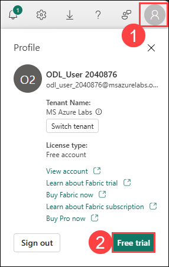

# Exercise 1: Ingest data with a pipeline in Microsoft Fabric

### Estimated Duration: 90 Minutes

In this exercise, you'll ingest data into a Microsoft Fabric lakehouse using pipelines and Apache Spark. Pipelines allow you to extract data from external sources and load it into OneLake. Spark enables you to transform the data at scale before storing it in lakehouse tables for analysis. Ensure data is successfully loaded into OneLake before applying transformations.

## Objectives

In this exercise, you will be able to complete the following tasks:

- Task 1: Sign up for Microsoft Fabric Trial
- Task 2: Create a workspace
- Task 3: Create a lakehouse
- Task 4: Create a pipeline
- Task 5: Create a notebook
- Task 6: Use SQL to query tables
- Task 7: Create a visual query
- Task 8: Create a report

## Task 1: Sign up for Microsoft Fabric Trial

In this task, you will initiate your 60-day free trial of Microsoft Fabric by signing up through the Fabric app, providing access to its comprehensive suite of data integration, analytics, and visualization tools

1. On the **Power BI homepage**, click on the **Profile icon (1)** on the top right, and then click on **Free trial (2)**.

    

1. On the **Activate your 60-day free Fabric trial capacity** dialog box, click **Activate**.  

    

1. On the **Successfully upgraded to Microsoft Fabric** pop-up, click **OK**.

    

1. Close the **Invite teammates to try Fabric to extend your trial** pop-up.

    

1. On the **Power BI homepage**, click on the **Profile icon (1)** on the top right again, and verify **Trial Status (2)**.

    

## Task 2: Create a workspace

In this task, you will create a Fabric workspace. The workspace will contain all the items needed for this lakehouse tutorial, which includes lakehouse, dataflows, Data Factory pipelines, notebooks, Power BI datasets, and reports.

1. On the left-hand pane of the Power BI portal, select **Workspaces (1)** and click on **+ New workspace (2)**.

    

1. On the **Create a workspace** page, enter the following details:
    - **Name:** Enter **fabric-<inject key="DeploymentID" enableCopy="false"/> (1)**
    - Expand the **Advanced (2)** section.

      

    - Select **License mode** as **Fabric capacity (3)**.
    - From the dropdown list, select the available **Capacity (4)**.
    - Click **Apply (5)** to create and open the workspace.
 
      .png)

1. On the **Introducing task flows (preview)** pop-up window, click **Got it**.

    

## Task 3: Create a Lakehouse

In this task, switch to the Data engineering experience and create a new Lakehouse. You'll use it to ingest and manage data in the following steps.

1. At the bottom left of the Power BI portal, select the **Power BI (1)** icon and switch to the **Fabric (2)** experience.

   

   

1. On the **Welcome to the Fabric view** pop-up window, click **Cancel**.

    

1. In the left pane, navigate to **Workspaces (1)** icon and select **fabric-<inject key="DeploymentID" enableCopy="false"/> (2)**. 

    

1. Click on **+ New item (1)** to create a new lakehouse. In the search box, search for **Lakehouse (2)** and select **Lakehouse (3)** from the list.

    

1. Enter the **Name** as **Lakehouse_<inject key="DeploymentID" enableCopy="false"/> (1)** and Click on **Create (2)**.

    

1. On the **Lakehouse_<inject key="DeploymentID" enableCopy="false"/>** tab in the left pane, click the **Ellipsis (...) (1)** menu for the **Files** node, click on **New subfolder (2)**.
    
    

1. Enter the Folder name as **new_data (1)** and click on **Create (2)**.

    

## Task 4: Create a pipeline

In this task, you'll create a pipeline to automate data workflows. Using the Copy data activity, you'll extract data from a source and copy it to a file in the lakehouse, streamlining the data ingestion process.

1. From the left navigation pane, select **fabric-<inject key="DeploymentID" enableCopy="false"/> (1)** workspace, then click on same workspace **(2)** and then click on **+ New item (3)**.

    

    .png)

1. In the search box, search for **pipeline (1)** and select **Pipeline (2)** under **Get data** from the list.

    

1. Create a new data pipeline named **Ingest Sales Data Pipeline (1)** and click on **Create (2)**. 
    
    
   
1. On the **Build a data pipeline to organize and move your data** page, select **Copy data assistant (1)**.

   

1. In the **Copy data** wizard, on the **Choose data source** page, search for **Http (1)** and select the **Http (2)** source from the results.

   

1. In the **Connection settings** page, enter the following settings and click on **Next (5)**:
    
    - URL: **`https://raw.githubusercontent.com/MicrosoftLearning/dp-data/main/sales.csv` (1)**
    - Connection: **Create new connection (2)**
    - Connection name: **Connection<inject key="DeploymentID" enableCopy="false"/> (3)**
    - Authentication kind: **Anonymous (4)**
  
      
    
1. On the **Choose data** page, keep the default settings and click **Next**.
    
    .png)
   
1. Wait for the data to be sampled, then verify the following settings:

   - **File format:** DelimitedText **(1)**
   - **Column delimiter:** Comma (,) **(2)**
   - **Row delimiter:** Line feed (\n) **(3)**
   - Click **Preview data (4)** to view a sample of the data.
   - After reviewing, close the preview and click **Next (5)**.
  
      .png)
    
      

1. On the **Choose data destination** page, click **OneLake catalog (1)** and select the lakehouse **Lakehouse\_<inject key="DeploymentID" enableCopy="false"/> (2)**.
    
    .png)

1. On the **Choose copy job mode** page, select **Full copy (1)** and click **Next (2)**.

    .png)

1. On the **Map to destination** page, set the following data destination options.
   
   - Select **Files (1)**
   - Folder path: Click on **Browse (2)**, select **new_data (3)** and click **OK (4)**.
   - File name: **sales.csv (5)**

     .png)
   
   - File format: **DelimitedText (6)**
   - Expand the **File format settings**
   - Column delimiter: **Comma (,) (7)**
   - Row delimiter: **Line feed (\n) (8)**
   - Click **Next (9)**

     .png)

1. On the **Review + save** page, review the details of your copy operation and then select **Save**.

    .png)

1. A new pipeline containing a **Copy data** activity is created, as shown here:

    

1. Click on the **Copy job (1)**, then select the **Settings (2)** tab, from the Connection dropdown **(3)**, select **Browse all (4)**.

    .png)

1. On **Choose a data source to get started**, click on **Copy job**.

    .png)

1. On the **Connect data source** page, click on **Sign in (1)** and select **<inject key="AzureAdUserEmail"></inject> (2)**. Then click **Connect (3)**.

    .png)

    .png)

    .png)

1. Under the **Home** tab, click on **Run**.

    .png)

1. On the **Save and run?** pop-up, click **Save and run**.

    .png)

1. When the pipeline starts to run, you can monitor its status in the **Output** pane under the pipeline designer. Use the **&#8635;** (*Refresh*) icon to refresh the status, and wait until it has been successfully updated.

    .png)

1. On the **Workspaces** page, select **fabric-<inject key="DeploymentID" enableCopy="false"/> (1)** and click **Lakehouse_<inject key="DeploymentID" enableCopy="false"/> (2)** to open the lakehouse.  

   .png)

1. In the **Explorer** pane, expand **new_data (1)** and select **sales.csv (2)** to open the file.  

   .png)

## Task 5: Create a Notebook

In this task, you'll create a Notebook to document your data analysis. You'll set up the environment, import libraries, and structure your code for exploration, visualization, and insights.

1. Select **Workspaces (1)** on left hand side and select **fabric-<inject key="DeploymentID" enableCopy="false"/> (2)**.

    

1. Click on **+ New item (1)** In the New Item panel, search for **Notebook (2)** and select **Notebook (3)**.

     

1. In the **New Notebook** pop-up window, leave the name as **default (1)** and click **Create (2)**.

     

1. After a few seconds, a new notebook with a single cell opens. Each notebook consists of code or markdown cells used for running code or adding formatted text.

     > **Note:** If a pop-up appears for **Enhance your notebook experience with AI tools**, click on **Skip tour**.
     >
     > 

1. Click **Add data items (1)** drop-down under explorer and select **Existing data source (2)** from the drop-down.

      

1. Select the previously created **Lakehouse_<inject key="DeploymentID" enableCopy="false"/> (1)** then click **Continue (2)**.
 
     

1. Select the existing cell in the notebook, clear the default code, and replace it with the **variable declaration (1)** below. Then click **&#9655; Run (2)** to execute the cell.

    ```python
   table_name = "sales"
    ```

    

    > **Note**: Since this is the first time you've run any Spark code in this session, the Spark pool must be started. This means that the first cell can take a minute or so to complete.

1. In the **Ellipsis (...) (1)** menu for the cell (at its top-right) select **Toggle parameter cell (2)**. This configures the cell so that the variables declared in it are treated as parameters when running the notebook from a pipeline.

     

1. Under the parameters cell, use the **+ Code** button to add a new code cell. 

      

   >**Note:** You might have to hover your mouse below the output to view the **+ Code** option.

1. Add the following code to it:

    ```python
    from pyspark.sql.functions import *
    
    # Read the new sales data
    df = spark.read.format("csv").option("header","true").option("inferSchema","true").load("Files/new_data/*.csv")

    ## Add month and year columns
    df = df.withColumn("Year", year(col("OrderDate"))).withColumn("Month", month(col("OrderDate")))

    # Derive FirstName and LastName columns
    df = df.withColumn("FirstName", split(col("CustomerName"), " ").getItem(0)).withColumn("LastName", split(col("CustomerName"), " ").getItem(1))

    # Filter and reorder columns
    df = df["SalesOrderNumber", "SalesOrderLineNumber", "OrderDate", "Year", "Month", "FirstName", "LastName", "EmailAddress", "Item", "Quantity", "UnitPrice", "TaxAmount"]

    # Load the data into a managed table
    #Managed tables are tables for which both the schema metadata and the data files are managed by Fabric. The data files for the table are created in the Tables folder.
    df.write.format("delta").mode("append").saveAsTable(table_name)
    ```

      

    This code loads the data from the sales.csv file that was ingested by the **Copy Data** activity, applies some transformation logic, and saves the transformed data as a **managed table** - appending the data if the table already exists.

1. Verify that your notebooks look similar to the one shown in the image below, and then use the **&#9655; Run all** button on the toolbar to run all of the cells it contains.

    

1. When the notebook run has completed, click on your  **Lakehouse_<inject key="DeploymentID" enableCopy="false"/> (1)** pane on the left, in the **Ellipsis (...) (2)** menu for **Tables** select **Refresh (3)** and verify that a **sales (4)** table has been created.

    > **Note:** The **sales** table will be visible only after the cell execution is completed.

    

1. Navigate back to the **Notebook** on the left pane and use the ⚙️ **Settings (1)** icon at the top to view the notebook settings. Then, set the **Name** of the notebook to **Load Sales Notebook (2)** and close the settings pane.

     

1. In the hub menu bar on the left, click on **fabric-<inject key="DeploymentID" enableCopy="false"/> (1)** and then select your **Lakehouse_<inject key="DeploymentID" enableCopy="false"/> (2)**. 

    

1. In the **Explorer** pane, refresh the **view (1)**. Then expand **Tables (2)**, and select the **sales (3)** table to see a preview of the data it contains.

    

    > **Note:** If you table is unable to load and showing as **Unable to load table view**, select the **Table view (1)** option and switch to **File view (2)**. Then open the file displayed.
    >
    >  

## Task 6: Use SQL to query tables

In this task, you'll use SQL to query tables in a database. You'll write statements to retrieve, filter, and manipulate data, helping you analyze the dataset and build your SQL skills.

1. At the top-right of the Lakehouse page, switch from **Lakehouse** to **SQL analytics endpoint**. Then wait a short time until the SQL query endpoint for your lakehouse opens in a visual interface from which you can query its tables, as shown here:

    

1. Use the **New SQL query** button to open a new query editor, and enter the following SQL query:

    ```SQL
   SELECT Item, SUM(Quantity * UnitPrice) AS Revenue
   FROM sales
   GROUP BY Item
   ORDER BY Revenue DESC;
    ```

    

1. Use the **&#9655; Run** button to run the query and view the results, which should show the total revenue for each product.

    

## Task 7: Create a visual query

In this task, you'll create a visual query in Power BI using Power Query. Start by adding the Sales table to the query editor, select the necessary columns, and applying a Group By transformation to count distinct line items per sales order. Then, review the summarized results.

1. On the toolbar under **New SQL query (1)** drop-down select **New visual query (2)**.

    

1. In the Lakehouse, navigate to **Schemas**, then to **dbo**, expand the **tables** folder and select the **sales** table. In the sales table, click on **Ellipsis &#8230; (1)** and select **Insert into canvas (2)**. It is in the new visual query editor pane that opens to create a Power Query. 

    

1. In the **Manage columns (1)** menu, select **Choose columns (2)**. Then select only the **SalesOrderNumber and SalesOrderLineNumber (3)** columns and click on **OK (4)**.

    

    

1. Click on **+ (1)**, in the **Transform table** menu, select **Group by (2)**.

    

1. Then group the data by using the following **Basic** settings.
   
   - Group by: **SalesOrderNumber (1)**
   - New column name: **LineItems (2)**
   - Operation: **Count distinct values (3)**
   - Column: **SalesOrderLineNumber (4)**
   - Click **OK (5)**

     

1. When you're done, the results pane under the visual query shows the number of line items for each sales order.

    

## Task 8: Create a report

In this task, you'll create a report to visualize your data findings. You'll select relevant data, choose appropriate visuals, and organize the report to clearly present insights and support data-driven decisions.

1. First, we will need to create a Semantic model. At the top of the SQL analytics endpoint page, select the **New semantic model** tab.
    
    

2. Provide the Direct Lake semantic model name as **Lakehouse_<inject key="DeploymentID" enableCopy="false"/> (1)** and select **sales (2)** table from the list. Click on **Confirm (3)**.

    

3. Go back to the **fabric-<inject key="DeploymentID" enableCopy="false"/> (1)** workspace from the left pane. Select recently created semantic model named as **Lakehouse_<inject key="DeploymentID" enableCopy="false"/> (2)**

    

4. Click on **Open semantic model** to view the table.

   

5. Once the model is opened, the **sales** table will appear.

   

6. Switch to editing mode. In the top menu bar, select the **File (1)** tab. Then select **Create new report (2)**.

    

7. In the **Data** pane on the right, expand the **sales** table. Then select the following fields:
   
   - **Item (1)**
   - **Quantity (2)**
   - Then, a **Table visualization (3)** is added to the report.

        

8. Hide the **Data** and **Filters** panes to create more space if required. Then, make sure the **Table visualization is selected (1)** and in the **Visualizations** pane, change the visualization to a **Clustered bar chart (2)** and resize it as shown here.

   

   

9. On the **File (1)** menu, select **Save As (2)**. Then, name the Report as **Item Sales Report (3)** and click **Save (4)** in the workspace you created previously.

   
   
   

10. In the hub menu bar on the left, select your workspace to verify that it contains the following items:
    - Your lakehouse.
    - The SQL endpoint for your lakehouse.
    - A default dataset for the tables in your lakehouse.
    - The **Item Sales Report** report.

> **Congratulations** on completing the task! Now, it's time to validate it. Here are the steps:
> - If you receive a success message, you can proceed to the next task.
> - If not, carefully read the error message and retry the step, following the instructions in the lab guide. 
> - If you need any assistance, please contact us at cloudlabs-support@spektrasystems.com. We are available 24/7 to help you out.

<validation step="09d5de71-ba8a-42fa-a261-b57c69f32b12" />

## Summary

In this exercise, you:

- Created a Workspace and a Lakehouse to organize and manage your data environment.
- Imported data into the Lakehouse.
- Explored how a Lakehouse stores data as both files and tables in OneLake.
- Learned that managed tables in the Lakehouse can be queried using SQL.
- Observed that these tables are automatically included in a default dataset, enabling seamless data visualization.

### You have successfully completed the exercise. Click on Next >> to proceed with the next exercise.

   
